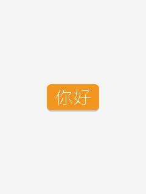

# 一. Framebuffer Driver（利用帧缓冲显示）


Usage（用法）

```python
disp = lv.linux_fbdev_create()
lv.linux_fbdev_set_file(disp, "/dev/fb0")
```

# 二. File System Interfaces（文件系统接口）

Usage（用法）

```python
import fs_driver
fs_drv = lv.fs_drv_t()
fs_driver.fs_register(fs_drv, 'L')
```

### 1. 显示 GIF


```python
img = lv.gif(lv.screen_active())
img.set_src( "L:/root/astronaut_ezgif.gif")
img.align(lv.ALIGN.CENTER, -50, 0)
```

### 2. 显示中文

在 [Font Converter — LVGL](https://lvgl.io/tools/fontconverter) 中，根据提示填写相关信息，将 .ttf 字体文件中指定字符转换为 .bin

alibaba.bin 中处理了'你''好'两个字符



```python
myfont_cn = lv.binfont_create('L:/root/alibaba.bin')
label = lv.label(btn)
label.set_style_text_font(myfont_cn, 0)
label.set_text("你好")
```

# 三. Input device interface（输入设备接口）

创建输入设备

```python
indev = lv.indev_create()
indev.set_type(lv.INDEV_TYPE....)
indev.set_read_cb(read_cb)

def read_cb(indev, data) -> int:
```

### 1. 按键输入


按钮分配给屏幕的特定坐标。 如果按下按钮，它将模拟按下指定坐标。

```python
indev = lv.indev_create()
indev.set_type(lv.INDEV_TYPE.BUTTON)
indev.set_read_cb(read_cb)
point = lv.point_t()
point.x = x
point.y = y
indev.set_button_points(point)

def read_cb(indev, data) -> int:
    data.state = lv.INDEV_STATE.PRESSED if ((is_pressed() & 1) == 1) else lv.INDEV_STATE.RELEASED
    return 0
```

### 2. 鼠标输入


```python
indev = lv.indev_create()
indev.set_type(lv.INDEV_TYPE.POINTER)
indev.set_read_cb(read_cb)

def read_cb(indev, data) -> int:
    data.point.x += getDeltaX()
    data.point.y -= getDeltaY()
    # Handle coordinate overflow cases
    data.point.x = min(data.point.x, lv.screen_active().get_width() - 1)
    data.point.y = min(data.point.y, lv.screen_active().get_height() - 1)
    data.point.x = max(data.point.x, 0)
    data.point.y = max(data.point.y, 0)
    data.state = lv.INDEV_STATE.PRESSED if ((is_pressed() & 1) == 1) else lv.INDEV_STATE.RELEASED
    return 0
```

# 四. Display interface（显示接口）

创建显示

```python
buf_size = width * height * ...
buf1 = bytearray(buf_size)
buf2 = bytearray(buf_size)

disp_drv = lv.display_create(width, height)
disp_drv.set_color_format(lv.COLOR_FORMAT....)
disp_drv.set_buffers(buf1, buf2, buf_size, lv.DISPLAY_RENDER_MODE....)
disp_drv.set_flush_cb(flush_cb)

def flush_cb(disp, area, color_p):
    data_view = color_p.__dereference__(self.buf_size)
    data_bytes = bytes(data_view)
    display(data_bytes)
    disp.flush_ready()
```

# 五. Examples（示例）

| 示例                                  | 说明                                           |
| ------------------------------------- | ---------------------------------------------- |
| [0.framebuffer.py](/0.framebuffer.py) | 利用帧缓冲显示 Hello World！                   |
| [1.file_system.py](1.file_system.py)  | 利用文件系统显示 GIF 和中文                    |
| [2.key.py](2.key.py)                  | 按键输入                                       |
| [3.msdev.py](3.msdev.py)              | 鼠标输入                                       |
| [4.mpy_output.py](4.mpy_output.py)    | 将图像显示数据利用命名管道输出                 |
| [4.py_display.py](4.py_display.py)    | 使用 python 将图像显示数据从命名管道取出并显示 |

运行例程 4 前需要执行 `mkfifo /tmp/my_fifo` 创建命名管道，例程 4 需要一起运行，[4.mpy_output.py](4.mpy_output.py) 在micropython中运行，[4.py_display.py](4.py_display.py) 在 python 中运行
